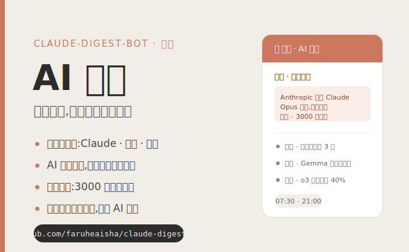

# claude-digest-bot



An automated AI news digest system that scrapes, filters, and delivers a daily briefing covering Claude/Anthropic, Chinese AI, and global AI events — twice a day, via WeChat.

## What it does

- **Morning brief** (07:30 Beijing): top articles per zone, scored by importance — fast and scannable
- **Evening digest** (21:00 Beijing): a full report led by an in-depth long-form analysis article, followed by the three news zones
- Generates both `.md` (for archiving) and `.html` (for WeChat delivery and future blog use)
- Holds finished content and delivers exactly at the scheduled time (generation can start hours early)

### Rich news cards

Every displayed article is rendered as a vertical card:

1. **Title** + importance icon
2. **Cover image** — the real `og:image` pulled from the source article (skipped if none is found; never synthesized)
3. **Key points** — 2–3 highlighted takeaways
4. **Summary** — a ~200-character editorial paragraph
5. **Source** + tags + **publish date** (annotated under the image)

Cards are generated by a two-pass pipeline: a cheap importance pass over all ~60 fetched articles, then a richer enrichment pass (key points + summary) over only the ~15 articles that will actually be displayed — quality-gated so thin or empty results are dropped.

### Evening lead article

The evening digest opens with a 3000+ word long-form analysis written from the day's top stories:

- Multi-section structure with sub-headings, pull-quotes, lists, and bold emphasis for visual rhythm
- A quality-review loop (generate → score → revise) gates the result before it ships
- AI-flavor removal pass (huashu-proofreading style) for a more human voice
- Inline images use **real images from the source articles** with captions naming the source — no AI-generated or stock filler

All generation runs on the DeepSeek API.

## Content zones

| Zone | Sources |
|------|---------|
| Claude / Anthropic | anthropic.com/news, anthropic.com/research, GitHub anthropics org |
| 国内 AI 动态 | 机器之心, 量子位, 36kr, 极客公园 |
| 全球 AI 大事件 | OpenAI blog, Google DeepMind, Hugging Face, The Verge AI, TechCrunch AI |

## Setup

### 1. Clone and install dependencies

```bash
git clone https://github.com/faruheaisha/claude-digest-bot
cd claude-digest-bot
pip install -r requirements.txt
```

### 2. Configure environment

```bash
cp .env.example .env
# Edit .env and fill in your keys:
#   DEEPSEEK_API_KEY  — from https://platform.deepseek.com
#   ILINK_TOKEN       — your ilink WeChat bridge token
#   WECHAT_UID        — your WeChat UID
#   GITHUB_TOKEN      — optional, increases GitHub API rate limit
```

### 3. Test with dry-run

```bash
python main.py --mode evening --dry-run
```

This generates files under `archive/YYYY/MM/` without sending to WeChat.

### 4. Schedule with cron (server, UTC timezone)

```cron
# Morning brief  07:30 Beijing = 23:30 UTC
30 23 * * * cd /path/to/claude-digest-bot && python main.py --mode morning >> logs/cron.log 2>&1

# Evening digest 21:00 Beijing = 13:00 UTC
0 13 * * * cd /path/to/claude-digest-bot && python main.py --mode evening >> logs/cron.log 2>&1
```

The pipeline can be started early — it generates the digest, then waits until the scheduled send time before delivering.

## Project structure

```
claude-digest-bot/
├── main.py                     # Entry point + pipeline orchestration
├── config.yaml                 # Source URLs, fetch limits, schedule config
├── fetchers/                   # Per-source scrapers (RSS + HTML scrape) + og:image/date extraction
├── processors/
│   ├── summarizer.py           # DeepSeek scoring, enrichment (key points + summary), daily insight
│   ├── article_writer.py       # Evening long-form lead article (write → review → proofread → images)
│   ├── dedup.py                # De-duplication
│   └── linker.py               # Cross-zone tagging
├── formatters/                 # .md and .html output renderers
├── delivery/                   # WeChat ilink file delivery
└── templates/                  # Jinja2 HTML template (cards + lead article styling)
```

## WeChat delivery setup

This bot requires a running [wechat-claude-code](https://github.com/faruheaisha/wechat-claude-code) instance with a valid ilink token. See that project's README for setup instructions. Once configured, copy your `ILINK_TOKEN` and `WECHAT_UID` into `.env`.

## Security

**Never commit secrets.** All credentials (`DEEPSEEK_API_KEY`, `ILINK_TOKEN`, `WECHAT_UID`, `GITHUB_TOKEN`) are read from environment variables / `.env`, which is gitignored. No tokens, server IPs, or personal identifiers are hardcoded in the source. Before pushing, verify with:

```bash
git diff --staged   # review what you're about to commit
```

The `.gitignore` already excludes `.env`, credential files, logs, and the local `archive/`.

## Archive

Generated digests are saved to `archive/YYYY/MM/YYYY-MM-DD-{morning,evening}.{md,html}`. The `archive/` directory is gitignored by default — add it to version control only if you want a public historical record (and only after confirming it contains no private content).

## License

[MIT](LICENSE)
